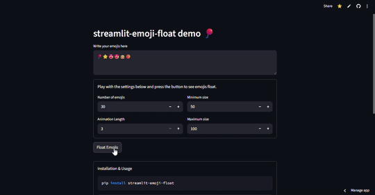

# streamlit-emoji-float

`streamlit-emoji-float` is a fun custom Streamlit component that animates emojis, making them float on your Streamlit app.



## Installation

```bash
pip install streamlit-emoji-float
```

## Usage

```python
from streamlit_emoji_float import emoji_float

# Usage with default emojis
emoji_float()

# Usage with custom parameters
emoji_float(
    emojis=["🔥", "🚀", "🎉"],
    count=20,
    minSize=50,
    maxSize=100,
    animationLength=5
)
```

`emojis:` List of emoji characters to animate (default: ["⭐", "😊", "🎈"])  
`count:` Number of emojis to spawn (default: 50)  
`minSize:` Minimum size in pixels (default: 50)  
`maxSize:` Maximum size in pixels (default: 100)  
`animationLength:` Duration of floating animation (default: 3)  
`key:` Streamlit component key for uniqueness

<a href="https://coff.ee/jncel">
  
</a>
